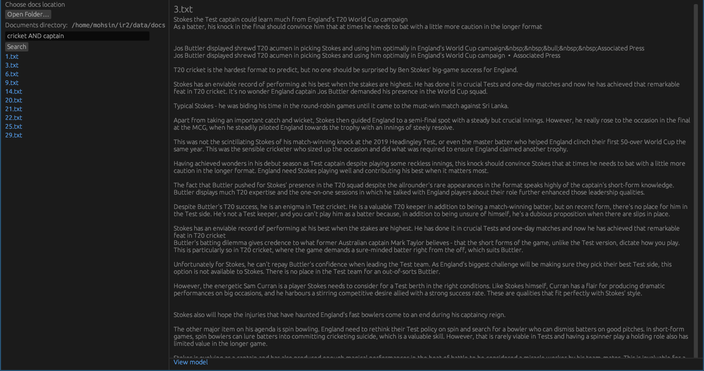

<h1 align="center"> Boolean Retrieval </h1>
<p align="center"> CS4051 - Information Retrieval - A1 Programming Assignment </p>
<div align="center"></div>
<hr/>

# Compiling from source 
requires [cargo](https://doc.rust-lang.org/cargo/getting-started/installation.html)
## Run
```sh
cargo run
```
## Build for release
```sh
cargo build --release
```
## Cross compile
### windows
requires [rustup](https://rustup.rs/), [cargo](https://doc.rust-lang.org/cargo/getting-started/installation.html) and mingw ([AUR](https://archlinux.org/packages/community/x86_64/mingw-w64-gcc/))
```sh
rustup target add x86_64-pc-windows-gnu 
cargo build --target x86_64-pc-windows-gnu --release
```
